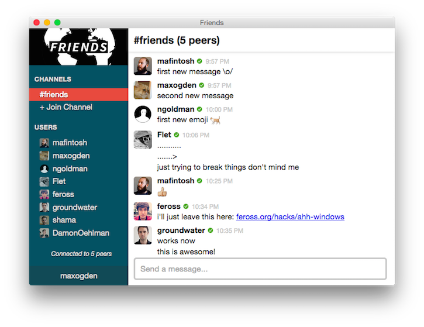

# Friends

[![travis][travis-image]][travis-url]
[![david][david-image]][david-url]

[travis-image]: https://img.shields.io/travis/moose-team/friends.svg?style=flat-square
[travis-url]: https://travis-ci.org/moose-team/friends
[david-image]: https://img.shields.io/david/moose-team/friends.svg?style=flat-square
[david-url]: https://david-dm.org/moose-team/friends


### P2P chat powered by the Web



**Alpha quality** you probably only want to use this if you like to send pull requests
fixing things :)

## How it works

See [our site](http://moose-team.github.io/friends/) or the `gh-pages` branch.

## Install

### Prerequisites

You'll need the newest [io.js](https://iojs.org) and npm (`>= 1.8.1`, `>= 2.8.3`)

### Build

Clone the sources locally:

```sh
$ git clone https://github.com/moose-team/friends

$ cd friends
```

Install project dependencies:

```sh
$ npm install
```

Compile leveldown for [electron](http://electron.atom.io/):

```sh
$ npm run rebuild-leveldb
```

If you are not on 64-bit architecture, you will have to modify the command in
package.json:

```
"rebuild-leveldb": "cd node_modules/leveldown && set HOME=~/.electron-gyp && node-gyp rebuild --target=0.34.2 --arch=x64 --dist-url=https://atom.io/download/atom-shell"
```

to use `--arch=ia32`.


## Usage

### GitHub Login

Friends currently uses your git + github configuration.

If you don't already have a public key on GitHub and its private key on your
machine, you'll need to [set that up
first](https://help.github.com/articles/generating-ssh-keys/). Make sure your
github username is also set, using `git config --global user.username
yourusername`.

If this doesn't work, do this to get debug information:

```
$ npm i github-current-user -g
$ DEBUG=* github-current-user
```

and then report an [issue](https://github.com/moose-team/friends/issues).

**Note**: DSA keys are not supported. You should switch to RSA anyway for security reasons.

If it can't verify you, try doing `ssh-add ~/.ssh/id_rsa`. Your key should show up when you run `ssh-add -l`.

### Run

To run from the command line, execute `npm start`.

To create a distributable app, run `npm run package`.

## Contributing

Contributions welcome! Please read the [contributing guidelines](CONTRIBUTING.md) before getting started.

## License

[MIT](LICENSE.md)
